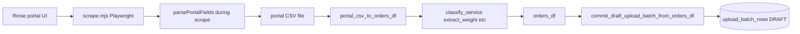
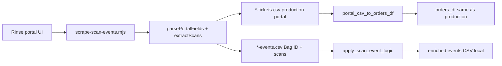

# Rinse integration — full pipeline note (for ChatGPT / assistants)

**Repo:** `laundry_app` (Washpro / Laundry Ops)  
**Rinse vendor portal:** https://www.rinse.com/vendors/ → cleaner tickets list (e.g. `cleanertickets/?status=at_vendor&page=1`)  
**Scraper directory:** `scripts/rinse-cleanertickets/`  
**Backend:** `backend/` (Flask API on Azure), MySQL upload batches

This document describes **where logic runs** (during Playwright scrape vs after, in Python) for **production** and for the **scan-events extension** (local / future; not wired to production import today).

---

## 1. Two scrapers — do not confuse them

| Script | Production? | Output | Purpose |
|--------|-------------|--------|---------|
| **`scrape.mjs`** | **Yes** — run by API via `backend/rinse_bag_export_runner.py` | Portal CSV (16 columns) or legacy debug CSV | Daily bag/ticket import into upload draft batch |
| **`scrape-scan-events.mjs`** | **No** — local only (`run-local-scan-events.sh`) | **Two files:** `*-tickets.csv` (production portal) + `*-events.csv` (`Bag ID` + scans only) | Capture Scans table linked by bag id; no redundant portal columns on events |

**Critical rule:** Production behavior must not depend on changing `scrape.mjs` for scan-events. Scan-events **imports** shared functions from `scrape.mjs` (`expandRowAndReadBag`, `parsePortalFields`, `portalDataRow`, etc.) so ticket handling matches production; only the Scans table read is extra.

---

## 2. Production — logic **during** scrape (`scrape.mjs`)

Triggered by: admin Rinse import job, `POST /admin/rinse/import-upload-batch`, or manual `node scrape.mjs` locally.

### 2.1 Environment (typical production import)

Set on API host or `scripts/rinse-cleanertickets/.env`:

- `RINSE_TICKETS_URL` — ticket **list** URL (not `/vendors/` login hub)
- `RINSE_STORAGE_STATE` — Playwright auth JSON (e.g. `./rinse-auth.json`)
- `RINSE_CSV_LAYOUT=portal` — **forced** by `rinse_import_subprocess_extra_env()` on import
- `RINSE_MAX_PAGES`, `RINSE_PAGE_START`, pagination / timing vars (`RINSE_PAGE_SETTLE_MS`, `RINSE_EXPAND_SETTLE_MS`, `RINSE_SHOW_BAG_WAIT_MS`, …)
- `OUTPUT_CSV` — absolute path for temp CSV during import

Runner: `backend/rinse_bag_export_runner.run_bag_export_csv()` → subprocess `node scrape.mjs`.

### 2.2 Browser flow (per list page)

1. **Login / session** — `rinse-auth.json` or `RINSE_EMAIL` + `RINSE_PASSWORD`.
2. **Navigate** paginated cleaner-tickets URLs (`page=` query param).
3. **Find ticket rows** — scoped ticket `<table>` (`ticketTableBodyRows`) or fallback selectors; scroll/wheel so lazy rows appear.
4. **Filter rows** — skip header `<th>`, scan-table sub-rows, single-cell detail rows, non-ticket lines (`isMainListTicketRow`, `portalListRowPeekOk`, etc.).
5. **Per ticket row:**
   - **`expandRowAndReadBag`** — expand row, click **“Show bag details”** when needed, read bag ID / display from DOM.
   - **`parsePortalFields(collapsed, expanded, tdTexts, bagDisplay)`** — **this is the main “massage” during scrape** for portal CSV:
     - Builds **Date**, **Estd. Delivery**, **Customer**, **# WF LBS**, **# HD**, **# WF ITEMS**, **Weight**, **Notes**
     - Flag columns: **USE OXIC**, **Use Hypo**, **USE FAB**, **Low DRY**, **NO SCEN**, **Extra Scen** (`X` or blank from text heuristics)
     - **Service Type**, **Sub-Service** from bag line parentheses
     - **Bag ID** column = full bag display string (e.g. `9D498298XU (Hang Dry)`)
   - One **output row per ticket** (not per scan).
6. **Stop pagination** when: empty table, duplicate page fingerprint, duplicate bag signature, no next page in UI, or landed page ≠ requested page.
7. **Write CSV** — if `RINSE_CSV_LAYOUT=portal`, header is exactly:

```
Date, Estd. Delivery, Customer, # WF LBS, # HD, # WF ITEMS, Weight, Notes,
USE OXIC, Use Hypo, USE FAB, Low DRY, NO SCEN, Extra Scen, Service Type, Sub-Service, Bag ID
```

**Legacy layout** (`RINSE_CSV_LAYOUT=legacy`): `page, row_index, customer_snippet, bag_id, raw_line` — not used for production import.

### 2.3 What does **not** happen in production scrape

- No Scans table export.
- No `portal_csv_to_orders_df` — that is **Python after** scrape.
- No database writes.

---

## 3. Production — logic **after** scrape (upload batch / “massage on upload”)

Orchestration: `backend/rinse_export_routes._rinse_import_after_auth()`  
Single scrape round: `_rinse_import_run_single_scrape()` → parse → commit.

```
scrape.mjs  →  portal CSV (temp file)  →  portal_csv_to_orders_df()  →  orders_df  →  commit_draft_upload_batch_from_orders_df()  →  MySQL upload_batches + upload_batch_rows
```

### 3.1 Step A — `portal_csv_to_orders_df` (`backend/rinse_portal_csv.py`)

**Input:** Portal CSV from scrape (required columns: `Date`, `Customer`, `Weight`, `Notes`, `Bag ID`).

**Per CSV row** (one row per ticket in production scrape):

| Output column | Logic |
|---------------|--------|
| `Date_Clean` | `_parse_portal_date(Date)` — handles `TODAY`, `Tue 4/14/2026`, uses `etl.transform_orders.extract_date_from_text` |
| `Name_Clean` | `Customer` trimmed; skip row if missing |
| `Weight_Num` | `extract_weight([# WF LBS, Weight, Notes, Bag ID])` — only explicit lbs / safe numerics; **does not** treat `# WF ITEMS` or `# HD` as pounds |
| `ServiceType` | `classify_service([Service Type, Sub-Service, # WF LBS, # HD, # WF ITEMS, Weight, Notes, Bag ID])` — WF vs HD heuristics (Hang Dry, decimals → WF, integers → HD, etc.) |
| `RushType` | `RUSH` if `detect_rush_hint` on row cells (e.g. `TODAY` in date line), else `NON-RUSH` |
| `ticket_id` | Alphanumeric prefix of **Bag ID** (e.g. `BO9GVBCNFQ` from `BO9GVBCNFQ (Wash & Fold) (Full)`) |

**Post-process whole frame:**

- **BlueBottle override:** any `Name_Clean` containing `BLUEBOTTLE` → `ServiceType = HD`
- Sort by `Date_Clean`, `ticket_id` (preserve scrape order intent; avoid name-only dedupe)
- `ServiceType` as categorical `WF` | `HD`

**Important:** Portal import **does not** use `transform_orders()` on the full Excel grid — that path drops most portal rows (dates with `/`, cells with `LBS`, etc.). Portal has its own mapper.

**`# HD` handling:** If `# HD` is `NA`, WF count column is ignored; else `# HD` can feed classify_service as WF count signal.

### 3.2 Step B — `commit_draft_upload_batch_from_orders_df` (`backend/app.py`)

**Input:** `orders_df` with columns like `transform_orders` final output:  
`Date_Clean`, `Name_Clean`, `Weight_Num`, `ServiceType`, `RushType`, optional `ticket_id`.

**Normalization:**

- Strip `Name_Clean`
- `Weight_Num` → `normalize_weight()`
- `fingerprint` per row from name + weight + service (for ops tooling)

**Batch lifecycle:**

- Close existing **DRAFT** upload batch for tenant
- Close same-day non-**CONFIRMED** batches for that `batch_date`
- Insert new `upload_batches` row (`state=DRAFT`, `file_name` = virtual name e.g. rinse portal import)

**Per order row → `upload_batch_rows`:**

| Check | Result |
|-------|--------|
| `Date_Clean` < `batch_date` | `NEEDS_ATTENTION` / `OLDER_THAN_BATCH_DATE` |
| Identity in `orders_final` within `DUPLICATE_LOOKBACK_DAYS` (default 3) | `REJECTED_DUPLICATE` / `ALREADY_IN_FINAL` |
| Identity in `orders_staging` (sent/forced checkout) | `REJECTED_DUPLICATE` / `ALREADY_SENT_OR_FORCED` or `DUPLICATE_IN_STAGING` |
| Else | `ACCEPTED` / `OK` |

**Identity key:** `build_identity_key(name_clean, weight_num, service_type, date_clean)` — same customer + weight + service + date.

**Rush on commit:** Row is `RUSH` if CSV `RushType` is RUSH **or** `Date_Clean == batch_date`.

**Stored:** `date_clean`, `name_clean`, `weight_num`, `service_type`, `rush_type`, `row_status`, `reason`, optional `ticket_id`.

User then reviews draft batch in UI and confirms → staging / final orders pipeline (outside this note).

### 3.3 Sequential chunk mode (large imports)

If job sets `sequential_chunk_pages` (e.g. 5 pages per subprocess):

- Multiple `scrape.mjs` runs with advancing `RINSE_PAGE_START`
- Each chunk → `portal_csv_to_orders_df` → append to list
- `pd.concat` all chunks → **one** `commit_draft_upload_batch_from_orders_df`

Avoids partial commits per chunk.

### 3.4 Manual portal CSV upload (same massage, no scrape)

`POST /upload_orders_portal_csv` and similar paths also call `portal_csv_to_orders_df` — same rules as after production scrape.

---

## 4. Scan-events extension — logic **during** scrape (`scrape-scan-events.mjs`)

**Not** called by production API today.

### 4.1 Same as production (imported from `scrape.mjs`)

- Pagination, session, row filters, `expandRowAndReadBag`, `parsePortalFields`, `portalDataRow`
- Progress lines match production style (bag id, date, service, lbs, #HD)

### 4.2 Add-on only (after expand)

- **`extractScansFromExpandedTicket`** (`rinse-playwright-lib.mjs`) — reads **Scans** table: Rack, Time Scanned, User, Purpose; badges → **Last Location**, **Last Scan** (`Y` or blank)
**`scan-events-YYYY-MM-DD-tickets.csv`** — one row per bag; **same 16 columns** as production `scrape.mjs` portal output.

**`scan-events-YYYY-MM-DD-events.csv`** — one row per scan; columns only:

```
Bag ID, Scan Index, Rack, Time Scanned, User, Purpose, Last Location, Last Scan
```

`Bag ID` = unique alphanumeric code (e.g. `9D498298XU`), same as `ticket_id` from `portal_csv_to_orders_df`. Join to tickets file via prefix of full `Bag ID` display column.

**Optional:** `RINSE_SCAN_INCLUDE_EMPTY_TICKETS=1` — include tickets with zero scans in tickets file only.

---

## 5. Scan-events — logic **after** scrape (Python, local)

**Not** in production upload path unless you build a new API route.

### 5.1 Portal ticket path (same as production)

```bash
python3 -m backend.rinse_scan_events_cli portal-orders --tickets path/to/*-tickets.csv
```

→ `portal_only_df` (dedupe by Bag ID + Date + Customer) → **`portal_csv_to_orders_df`** — same `orders_df` as production.

### 5.2 Event add-on path (extension only)

```bash
python3 -m backend.rinse_scan_events_cli apply --csv path/to/scan-events-....csv
```

`backend/rinse_scan_events_logic.apply_scan_event_logic()`:

- **Does not change** portal columns
- Parses **Time Scanned** → `scanned_at_parsed`
- Normalizes **Purpose** → `purpose_norm` (strips trailing “Last Scan” text)
- Sorts by `Bag ID` (+ Date, Customer), then time / Scan Index
- Flags: `is_cleaning_start`, `is_move_bag`, `is_weight_entry`, `is_sent_to_vendor`
- Per ticket (group by Bag ID): `is_latest_scan_in_ticket` on newest scan time
- Mirrors CSV badges: `flag_last_location_csv`, `flag_last_scan_csv`

**Extend new business rules in `rinse_scan_events_logic.py`**, not in `scrape.mjs`.

---

## 6. End-to-end diagrams

### Production (import upload batch)



### Scan-events (local)



---

## 7. Key files (quick index)

| File | Role |
|------|------|
| `scripts/rinse-cleanertickets/scrape.mjs` | Production scraper + portal field parsing during scrape |
| `scripts/rinse-cleanertickets/scrape-scan-events.mjs` | Portal + scans export (local) |
| `scripts/rinse-cleanertickets/rinse-playwright-lib.mjs` | Shared session/pagination; Scans DOM parser |
| `backend/rinse_bag_export_runner.py` | Run `scrape.mjs` on API |
| `backend/rinse_export_routes.py` | Import job: scrape → parse → commit |
| `backend/rinse_portal_csv.py` | Portal CSV → `orders_df` (production massage) |
| `backend/rinse_scan_events_logic.py` | Scan column enrichment only |
| `backend/rinse_scan_events_cli.py` | Local CLI: `apply`, `summary`, `portal-orders` |
| `backend/app.py` | `commit_draft_upload_batch_from_orders_df` |
| `etl/transform_orders.py` | `extract_weight`, `classify_service`, `detect_rush_hint` (used by portal_csv) |
| `README_SCAN_EVENTS.md` | Operator docs for scan-events |

---

## 8. Instructions for ChatGPT when editing this system

1. **Production import** = `scrape.mjs` + `portal_csv_to_orders_df` + `commit_draft_upload_batch_from_orders_df`. Do not route production through scan-events scraper.
2. **Field shaping for Date/Customer/Weight/flags** = primarily **`parsePortalFields` in Node during scrape**; **service/weight/rush/ticket_id** = **`portal_csv_to_orders_df` in Python**.
3. **Scan-events** = duplicate production ticket logic via imports; add rules in **`rinse_scan_events_logic.py`** or new columns in `scrape-scan-events.mjs` only.
4. **Comparing outputs:** `*-tickets.csv` should match production `scrape.mjs` on the same pages (`bash run-local-production-scrape.sh` vs `run-local-scan-events.sh`).
5. **Auth:** credentials and `RINSE_TICKETS_URL` live in `scripts/rinse-cleanertickets/.env`, not repo root `.env`.
6. **BlueBottle**, duplicate detection, and rush rules are intentional — document changes if you alter them.

---

## 9. Example row shapes

**Production portal CSV (one row per ticket):**

```csv
Date,Estd. Delivery,Customer,# WF LBS,# HD,# WF ITEMS,Weight,Notes,USE OXIC,Use Hypo,USE FAB,Low DRY,NO SCEN,Extra Scen,Service Type,Sub-Service,Bag ID
"Sat 05/16/2026 TODAY","Sat 05/16/2026 TODAY","Amy Perez","","0","","0","","X","X","X","","","","Hang Dry","","9D498298XU (Hang Dry)"
```

**After `portal_csv_to_orders_df` (conceptual):**

```text
Date_Clean=2026-05-16, Name_Clean=Amy Perez, Weight_Num=None, ServiceType=HD, RushType=RUSH, ticket_id=9D498298XU
```

**Events CSV (two rows for same bag):**

```csv
Bag ID,Scan Index,Rack,Time Scanned,User,Purpose,Last Location,Last Scan
9D498298XU,1,023-NY-WF,"Thursday, May 14, 2026 11:13 PM",Washpro Driver,sent-to-vendor Last Scan,,Y
9D498298XU,2,023-NY-WF,"Thursday, May 14, 2026 10:21 PM",Harrell France,load-in,,
```

---

*Last aligned with repo: scan-events uses production portal CSV format + scan add-on columns; production scrape unchanged for bag import.*
